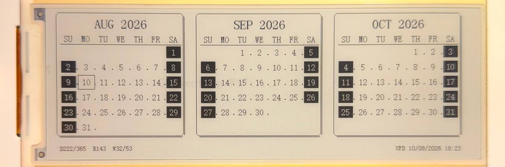

# Casio-Style E-Paper Calendar

Calendario perpetuo de tres meses sobre un panel E-Paper de 5.79" (792x272) con ESP32-S3, con la estética de las agendas electrónicas Casio de los 90 (serie SF / Data Bank).

El panel es biestable: una vez dibujada la imagen, **se mantiene sin alimentación**. El equipo sincroniza fecha por NTP una vez cada 24 h y el resto del tiempo duerme en deep sleep.



---

## Características

- Tres meses simultáneos: el actual y los dos siguientes
- Día de hoy resaltado con marco
- Fines de semana en video inverso (bloque negro, dígito blanco), como el Casio original
- Marco con esquinas recortadas y sombra desplazada
- Puntos separadores entre columnas, para la textura de matriz de puntos
- Línea de estado numérica al pie: día del año, días restantes, número de semana
- Provisioning WiFi por portal cautivo (sin credenciales hardcodeadas)
- Un único archivo `.ino`: driver del panel y fuentes incluidos

## Línea de estado

```
D222/365  R143  W32/53              UPD 10/08/2026 09:30
```

| Campo | Significado |
|---|---|
| `D222/365` | Día 222 de 365 del año |
| `R143` | Días restantes hasta fin de año |
| `W32/53` | Semana 32 de 53 (semana corrida, no ISO-8601) |
| `UPD ...` | Fecha y hora del último refresco |

---

## Hardware

| Componente | Detalle |
|---|---|
| MCU | ESP32-S3 |
| Panel | E-Paper 5.79", 792x272 visible, monocromo |
| Controlador | 2 × SSD1683 en cascada (396x272 cada uno) |
| Interfaz | SPI por software (bit-banging) |

### Pinout

| Señal | GPIO |
|---|---|
| SCK | 12 |
| MOSI | 11 |
| RES | 47 |
| DC | 46 |
| CS | 45 |
| BUSY | 48 |
| Alimentación del panel | 7 |
| Botón EXIT (reset WiFi) | 1 |

Si tu placa usa otro cableado, los defines están al comienzo de la Sección 1 del sketch.

---

## Compilación

### Dependencias

Solo dos librerías, ambas desde el Library Manager del IDE de Arduino:

- [WiFiManager](https://github.com/tzapu/WiFiManager) (tzapu) ≥ 2.0.17
- [NTPClient](https://github.com/arduino-libraries/NTPClient) (arduino-libraries)

El driver del panel y las tablas de fuente están embebidos en el `.ino`. No hace falta ningún archivo adicional en la carpeta del sketch.

### Configuración del IDE

- **Board:** ESP32S3 Dev Module
- **USB CDC On Boot:** Enabled (para ver el monitor serie por el USB-C)
- **Partition Scheme:** el que corresponda a tu tamaño de flash

### Zona horaria

Está fijada en UTC-3 (Argentina, sin horario de verano). Para cambiarla, editá el offset en segundos en las dos llamadas de la Sección 6:

```c
NTPClient timeClient(ntpUDP, "pool.ntp.org", -10800, 60000);
configTime(-10800, 0, "pool.ntp.org", "time.nist.gov");
```

---

## Primer arranque

1. Al no encontrar credenciales guardadas, el equipo levanta un AP llamado **`Electgpl-Calendar`**.
2. Conectate desde el celular o la PC; debería abrirse el portal cautivo (o entrá a `192.168.4.1`).
3. Elegí tu red **2.4 GHz** y cargá la contraseña. El ESP32-S3 no asocia a 5 GHz.
4. El equipo se reinicia, sincroniza por NTP, dibuja el calendario y entra en deep sleep.

Para borrar las credenciales guardadas, mantené presionado el botón **EXIT** durante 3 segundos al energizar.

---

## Notas técnicas

### El buffer es 800x272, el panel visible es 792x272

El panel lleva dos SSD1683 en cascada. Cada uno maneja 396x272 pero se direcciona como 400x300, así que en la unión quedan **8 columnas muertas**. El framebuffer se define como 800x272 y `Paint_SetPixel()` aplica un desplazamiento de 8 px para `Xpoint >= 396`.

### Presupuesto vertical: la trampa principal de este panel

`EPD_ShowChar()` rasteriza en franjas de 8 filas, por lo que **el alto real de cada fuente no coincide con su nombre**:

| `size1` | Ancho/carácter | Alto real |
|---|---|---|
| 12 | 6 px | **16 px** |
| 16 | 8 px | 16 px |
| 24 | 12 px | 24 px |

Con `Rotation 180`, `Paint_SetPixel()` calcula:

```c
Y = Paint.heightMemory - Ypoint - 1;   // uint16_t
```

Si `Ypoint >= 272`, la resta hace **underflow a ~65535**, y la dirección resultante (`Y * widthByte` ≈ 6,5 millones) escribe muy fuera del framebuffer de 27.200 bytes. El resultado es corrupción de memoria que suele manifestarse después como `Guru Meditation Error (LoadStoreError)` en un punto del código sin relación aparente con el dibujo.

**Regla:** `y_del_elemento + alto_de_su_fuente <= 272`, siempre. Una fuente 12 en `y=258` desborda, aunque "12 + 258 = 270" parezca seguro.

### Fuentes podadas

De la librería original se quitaron dos tablas:

- `ascii_4824` (fuente 48): 13.680 bytes de datos, no la usa este diseño
- `ascii_0806` (fuente 8): inalcanzable, `EPD_ShowChar()` hace `return` para `size1==8` porque la cadena de `if` solo cubre 12/16/24/48

Para restaurar la fuente 48: pegá `ascii_4824` desde el `EPDfont.h` original y agregá su rama en `EPD_ShowChar()`.

### Deriva del reloj en deep sleep

El timer de deep sleep corre sobre el oscilador RC interno de 150 kHz, con deriva térmica de varios por ciento. Sobre 24 h eso puede significar **decenas de minutos de corrimiento por día**, acumulativos: el refresco se va desplazando de horario con el tiempo.

La fecha mostrada siempre es correcta (resincroniza NTP en cada despertar), pero si el despertar llega a caer justo antes de medianoche, el panel muestra el día anterior durante esos minutos. La solución es calcular el tiempo restante hasta una hora fija (por ejemplo 00:05) en vez de dormir 24 h fijas, de modo que cada ciclo se re-ancle a la hora real.

### Video inverso

`EPD_ShowChar()` pinta el fondo del glifo con `!color`. Por eso, para texto blanco sobre negro alcanza con rellenar el área con `EPD_DrawRectangle(..., BLACK, 1)` y dibujar el texto con `WHITE`.

---

## Estructura del sketch

| Sección | Contenido |
|---|---|
| 1 | Capa SPI por software |
| 2 | Definiciones del panel y estructura `PAINT` |
| 3 | Tablas de fuente (12, 16, 24) |
| 4 | Secuencias de inicialización y refresco del SSD1683 |
| 5 | Primitivas de dibujo |
| 6 | Aplicación (calendario, estilo Casio, WiFi, deep sleep) |

---

## Créditos

Desarrollado por **Sebastián Caccavallo** — [ELECTGPL](https://www.youtube.com/@Electgpl)

El driver del panel parte del código de ejemplo del fabricante para el módulo E-Paper de 5.79", reorganizado, podado y documentado.

## Licencia

MIT
